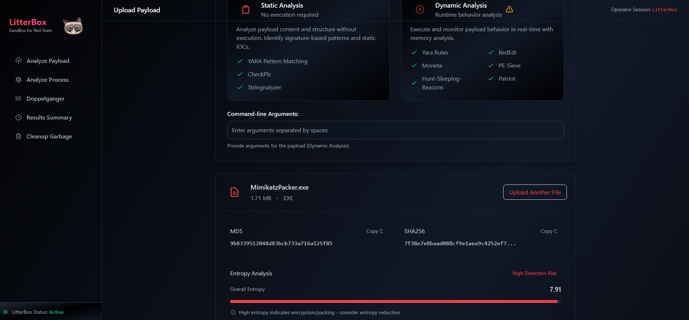
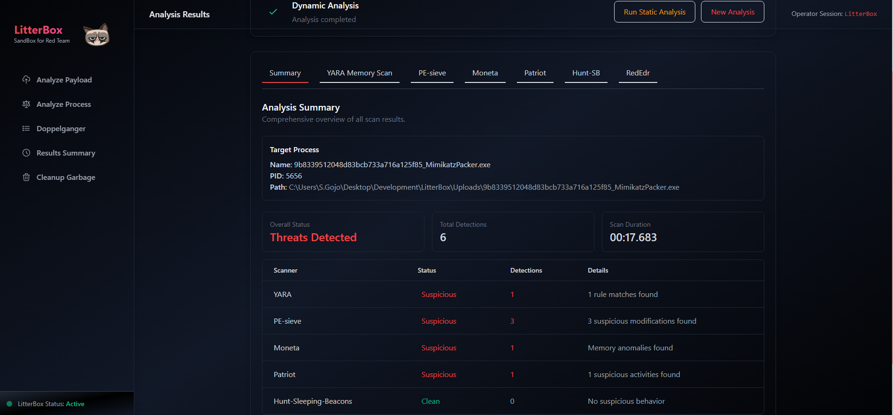
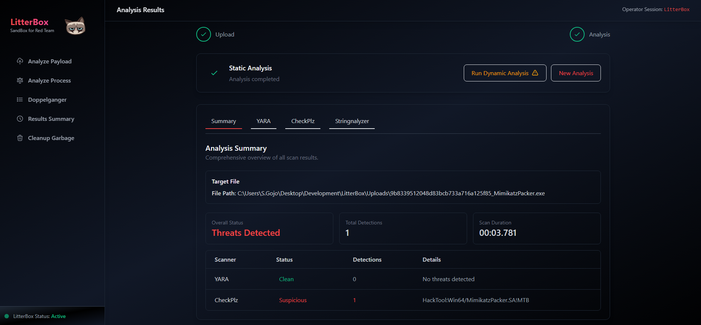
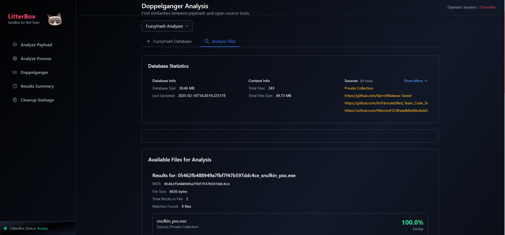
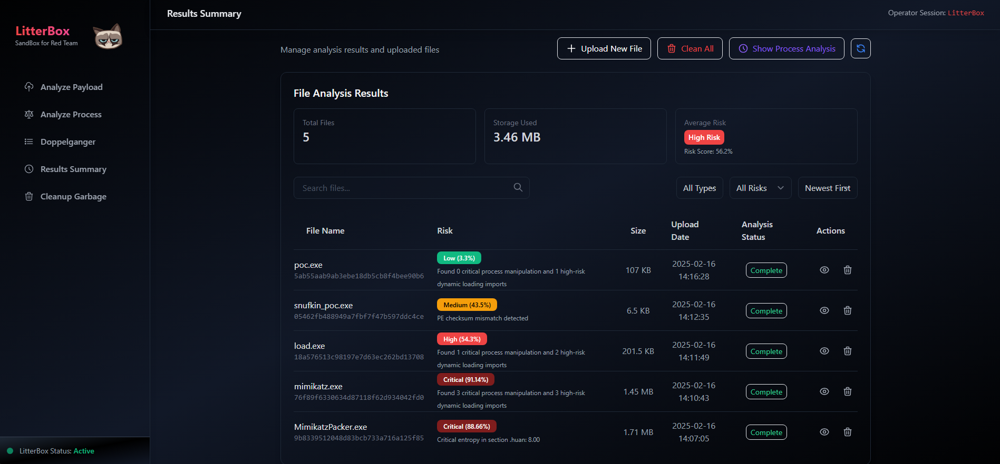

# LitterBox


[]()
[]()
[]()
[]()
[](https://github.com/BlackSnufkin/LitterBox/stargazers)

## Table of Contents
- [Overview](#overview)
- [Analysis Capabilities](#analysis-capabilities)
- [Analysis Engines](#analysis-engines)
- [Integrated Tools](#integrated-tools)
- [API Reference](#api-reference)
- [Installation](#installation)
- [Access Methods](#access-methods)
- [Configuration](#configuration)
- [Client Libraries](#client-libraries)
- [Contributing](#contributing)
- [Security Advisory](#security-advisory)
- [Acknowledgments](#acknowledgments)
- [Interface](#interface)

## Overview

LitterBox provides a controlled sandbox environment designed for security professionals to develop and test malware payloads. This platform allows red teams to:

* Test evasion techniques against modern detection techniques
* Validate detection signatures before field deployment
* Analyze malware behavior in an isolated environment
* Keep payloads in-house without exposing them to external security vendors
* Ensure payload functionality without triggering production security controls

The platform includes LLM-assisted analysis capabilities through the LitterBoxMCP server, offering advanced analytical insights using natural language processing technology.

**Note**: While designed primarily for red teams, LitterBox can be equally valuable for blue teams by shifting perspective – using the same tools in their malware analysis workflows.

## Analysis Capabilities

### Initial Processing

| Feature | Description |
|---------|-------------|
| File Identification | Multiple hashing algorithms (MD5, SHA256) |
| Entropy Analysis | Detection of encryption and obfuscation |
| Type Classification | Advanced MIME and file type analysis |
| Metadata Preservation | Original filename and timestamp tracking |

### Executable Analysis

For Windows PE files (.exe, .dll, .sys):

- Architecture identification (PE32/PE32+)
- Compilation timestamp verification
- Subsystem classification
- Entry point analysis
- Section enumeration and characterization
- Import/export table mapping

### Document Analysis

For Microsoft Office files:

- Macro detection and extraction
- VBA code security analysis
- Hidden content identification
- Obfuscation technique detection

## Analysis Engines

### Static Analysis

- Industry-standard signature detection
- Binary entropy profiling
- String extraction and classification
- Pattern matching for known indicators

### Dynamic Analysis

Available in dual operation modes:
- **File Analysis**: Focused on submitted samples
- **Process Analysis**: Targeting running processes by PID

Capabilities include:

- Runtime behavioral monitoring
- Memory region inspection and classification
- Process hollowing detection
- Code injection technique identification
- Sleep pattern analysis
- Windows telemetry collection via ETW

### Doppelganger Analysis

#### Blender Module
Provides system-wide process comparison by:
- Collecting IOCs from active processes
- Comparing process characteristics with submitted payloads
- Identifying behavioral similarities

#### FuzzyHash Module
Delivers code similarity analysis through:
- Maintained database of known tools and malware
- ssdeep fuzzy hash comparison methodology
- Detailed similarity scoring and reporting

## Integrated Tools

### Static Analysis Suite
- [YARA](https://github.com/elastic/protections-artifacts/tree/main/yara) - Signature detection engine
- [CheckPlz](https://github.com/BlackSnufkin/CheckPlz) - AV detection testing framework
- [Stringnalyzer](https://github.com/BlackSnufkin/Rusty-Playground/Stringnalyzer) - Advanced string analysis utility

### Dynamic Analysis Suite
- [YARA Memory](https://github.com/elastic/protections-artifacts/tree/main/yara) - Runtime pattern detection
- [PE-Sieve](https://github.com/hasherezade/pe-sieve) - In-memory malware detection
- [Moneta](https://github.com/forrest-orr/moneta) - Memory region IOC analyzer
- [Patriot](https://github.com/BlackSnufkin/patriot) - In-memory stealth technique detection
- [RedEdr](https://github.com/dobin/RedEdr) - ETW telemetry collection
- [Hunt-Sleeping-Beacons](https://github.com/thefLink/Hunt-Sleeping-Beacons) - C2 beacon analyzer
- [Hollows-Hunter](https://github.com/hasherezade/hollows_hunter) - Process hollowing detection

## API Reference

### File Operations
```http
POST   /upload                    # Upload samples for analysis
GET    /files                     # Retrieve processed file list
```

### Analysis Endpoints
```http
GET    /analyze/static/<hash>     # Execute static analysis
POST   /analyze/dynamic/<hash>    # Perform dynamic file analysis  
POST   /analyze/dynamic/<pid>     # Conduct process analysis
```

### Doppelganger API
```http
# Blender Module
GET    /doppelganger?type=blender               # Retrieve latest scan results
GET    /doppelganger?type=blender&hash=<hash>   # Compare process IOCs with payload  
POST   /doppelganger                            # Execute system scan with {"type": "blender", "operation": "scan"}

# FuzzyHash Module
GET    /doppelganger?type=fuzzy                 # Retrieve fuzzy analysis statistics
GET    /doppelganger?type=fuzzy&hash=<hash>     # Execute fuzzy hash analysis
POST   /doppelganger                            # Generate database with {"type": "fuzzy", "operation": "create_db", "folder_path": "C:\path\to\folder"}
```

### Results Retrieval (JSON)
```http
GET    /api/results/<hash>/info      # Retrieve file metadata
GET    /api/results/<hash>/static    # Access static analysis results
GET    /api/results/<hash>/dynamic   # Obtain dynamic analysis data
GET    /api/results/<pid>/dynamic    # Retrieve process analysis data
```

### Web Interface Results
```http
GET    /results/<hash>/info      # View file information
GET    /results/<hash>/static    # Access static analysis reports
GET    /results/<hash>/dynamic   # View dynamic analysis reports
GET    /results/<pid>/dynamic    # Access process analysis reports
```

### System Management
```http
GET    /health                   # System health verification
POST   /cleanup                  # Remove analysis artifacts
POST   /validate/<pid>           # Verify process accessibility
DELETE /file/<hash>              # Remove specific analysis
```

## Installation

### System Requirements
- Windows operating system (Linux not supported)
- Python 3.11 or higher
- Administrator privileges

### Deployment Process

1. Clone the repository:
```bash
git clone https://github.com/BlackSnufkin/LitterBox.git
cd LitterBox
```

2. Configure environment:
```bash
python -m venv venv
.\venv\Scripts\Activate.ps1
pip install -r requirements.txt
```

## Operation

Standard operation:
```bash
python litterbox.py
```

Diagnostic mode:
```bash
python litterbox.py --debug
```

## Access Methods

LitterBox offers three access interfaces:

- **Web UI**: Browser-based interface at `http://127.0.0.1:1337`
- **API Access**: Programmatic integration via Python client
- **LLM Integration**: AI agent interaction through MCP server

For API access, see the [Client Libraries](#client-libraries) section.

## Configuration

All settings are stored in `config/config.yml`. Edit this file to:

- Change server settings (host/port)
- Set allowed file types
- Configure analysis tools
- Adjust timeouts

## Client Libraries

For programmatic access to LitterBox, use the **GrumpyCats** package:

**[GrumpyCats Documentation](GrumpyCats/README.md)**

The package includes:

* **grumpycat.py**: Dual-purpose tool that functions as:
  * Standalone CLI utility for direct server interaction
  * Python library for integrating LitterBox capabilities into custom tools

* **LitterBoxMCP.py**: Specialized server component that:
  * Wraps the GrumpyCat library functionality
  * Enables LLM agents to interact with the LitterBox analysis platform
  * Provides natural language interfaces to malware analysis workflows

## Contributing

Development contributions should be conducted in feature branches on personal forks.
For detailed contribution guidelines, refer to: [CONTRIBUTING.md](./CONTRIBUTING.md)

## Security Advisory

- **DEVELOPMENT USE ONLY**: This platform is designed exclusively for testing environments. Production deployment presents significant security risks.
- **ISOLATION REQUIRED**: Execute only in isolated virtual machines or dedicated testing environments.
- **WARRANTY DISCLAIMER**: Provided without guarantees; use at your own risk.
- **LEGAL COMPLIANCE**: Users are responsible for ensuring all usage complies with applicable laws and regulations.

## Acknowledgments

This project incorporates technologies from the following contributors:

- [Elastic Security](https://github.com/elastic/protections-artifacts/tree/main/yara)
- [hasherezade](https://github.com/hasherezade/pe-sieve)
- [Forrest Orr](https://github.com/forrest-orr/moneta)
- [rasta-mouse](https://github.com/rasta-mouse/ThreatCheck)
- [thefLink](https://github.com/thefLink/Hunt-Sleeping-Beacons)
- [joe-desimone](https://github.com/joe-desimone/patriot)
- [dobin](https://github.com/dobin/RedEdr)

## Interface










